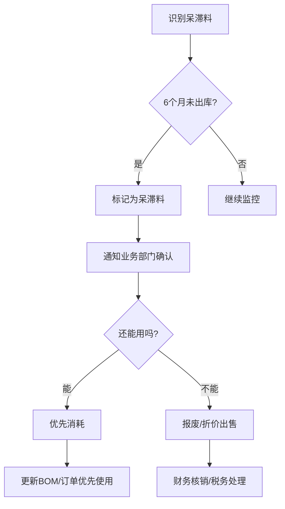

# 企业管理的108个问题 · 第74问

> 上一问我们聊了质量管理体系的价值（[第73问](/073-zhi-liang-guan-li-ti-xi-ISO-dui-qi-ye-zhen-de-you-bang-zhu-ma/)），核心观点：ISO 9001这样的质量体系是否有用，不取决于标准本身，而取决于企业"怎么用它"——当体系是"长出来的"而非"买来的"时，它的价值远超那张证书。
>
> 在运营管理中有两对"永恒的矛盾"：质量与成本是一对；另一对，就是库存管理的核心矛盾——
>
> **不断货 vs 不积压。**

"张总，我们仓库里C类物料堆了三年的量，但A类核心物料今晚就要断货了。"

这句话是不是很熟悉？

这不是某个企业的个别现象——它是库存管理的"宿命级难题"：

- **库存多了**：占用资金、压仓库、过期报废——钱长眠在货架上
- **库存少了**：断货、停工、丢单——客户跑到竞争对手那里去了

数据说话：中国制造业企业的平均库存周转率（Inventory Turnover）大约在3-5次/年，而日本丰田能做到30-50次/年。差距不是一个数量级——**是十倍**。

这说明什么？说明绝大多数企业"多出来的库存"，不是因为业务需要——而是因为管理不善。

---

## 一、先搞清楚一个底层问题：库存到底是什么？

很多人一提起库存就想到"货"，这是一个局限的理解。

**广义的库存，是"供给和需求之间的缓冲"。**

它的公式很简单：

**库存 = 供给速度 － 需求速度**

当供给大于需求时，库存增加；当需求大于供给时，库存消耗。

那为什么企业需要这个"缓冲"？因为供给和需求永远不可能完美同步——

- **需求有波动：** 双十一销量可能是平时的10倍
- **供给有不确定性：** 供应商可能延期、质量可能不达标
- **批量经济性：** 一次生产1000个比一次生产100个更便宜

**所以，"库存"不是敌人——"错误的库存"才是。**

---

## 二、库存问题的真正根源——不是"多"，是"结构"

很多老板看到仓库里的货第一反应是："太多了，清掉。"

但清完了呢？三个月后又堆满了。

**治标不治本——因为你在解决"库存多"这个结果，而不是"库存为什么多"这个原因。**

### 库存问题的四大根因：

**根因一：需求预测不准**

这是库存管理中最核心、也最无解的问题。

- **预测多了：** 货堆在仓库
- **预测少了：** 断货

为什么总是预测不准？不是"销售部门"不努力——而是需求本身就有不确定性：竞争对手的动作、市场趋势的变化、政策环境的影响……很多因素超出了预测模型的边界。

**核心矛盾：** 大多数企业按照"年度预算"做采购计划，但市场变化以"月"甚至"周"为单位。预算和现实的错位，直接导致库存结构失衡。

**根因二：安全库存设置不当**

安全库存是公司对抗不确定性的"保险"。

但很多企业的安全库存是怎么设的？

"我们觉得这个物料比较重要——安全库存设两周好了。"

谁来定？凭经验、凭直觉、凭"感觉上个月出过错"。

结果：该设安全库存的没有设，不该设的设了一大堆。

**根因三：供应链响应速度不够快**

如果你的供应商下单后7天就能送货，你只需要设7天的安全库存。

如果你的供应商下单后要30天才能送货——你就得备30天的安全库存。

**供应链周期越长，你需要的库存就越多。**

**根因四："囤货心理"和"保供倾向"**

这是最难解决的——人性问题。

- 采购员："多买一点总比少买好，万一缺料被老板骂呢？"
- 销售总监："双十一我们备5倍的量吧，万一爆了呢？"
- 生产经理："原材料多备点，省得换线的时候等料。"

**每个部门都在为自己的KPI"加保险"——结果就是整个公司的库存飙升。**

---

## 三、库存管理的核心方法论：

### ABC分类法——把精力放在最有价值的20%上

这是库存管理的基础设施，没有之一。

**逻辑很简单：** 不是所有物料的重要性都一样——把精力放在最值钱的20%上。

| 分类 | 占比（金额） | 占比（品种） | 管理策略 |
|------|------------|------------|---------|
| A类 | 70%-80% | 10%-20% | 严格管控：逐件跟踪、精准预测、高频盘点 |
| B类 | 15%-25% | 20%-30% | 适度管控：定期盘点、批量补货 |
| C类 | 5%-10% | 50%-70% | 简单管控：看板补货、双堆法、长周期采购 |

**实操案例：**

一家电子制造企业，A类物料是芯片（占采购额的72%，但只有15个料号）；C类物料是电阻电容（不到8%的金额，但占了600多个料号）。

**以前：** 所有物料一视同仁——采购员每天忙得焦头烂额，但芯片反而经常断货。

**改革后：**
- A类（芯片）：专人负责、每周复盘预测精度、安全库存逐周调整
- C类（阻容）：改为"双堆法"——两箱货，用完一箱自动触发补货，不用人工跟踪

**效果：** 芯片断货率下降80%，采购团队的工作效率提升约40%。

### 安全库存的"科学公式"——不要靠"感觉"

安全库存不是拍脑袋决定的——它有一个基本的数学模型：

```
安全库存 = Z × √(LT × σD² + D² × σLT²)
```

其中：
- **Z** = 服务水平因子（95% 服务水平 → Z=1.65；99% → Z=2.33）
- **LT** = 平均交货周期（天）
- **σD** = 日均需求的标准差
- **σLT** = 交货周期标准差
- **D** = 日均需求量

**翻译成人话：**

**安全库存量** = 你想要的服务水平 ×（需求波动 + 供应波动）综合计算出的缓冲天数

**关键洞察：** 如果你能把"供应波动"（σLT）降低——比如从±5天降到±1天——安全库存可以减少约一半。

**所以减库存最好的方法之一，不是"少订货"——而是"让供应商更可靠"。**

**一个简易版本（小企业也能用）：**

没有历史数据？用这个简化版：

```
安全库存天数 = 交货周期 × 1.5（不确定系数）
```

- 交货周期7天 → 安全库存备11天的量 → 约1.6周的用量
- 交货周期30天 → 安全库存备45天的量 → 约1.5个月的用量

**当你有6个月以上的数据后，切换到上面的公式。**

### 补货策略——什么时候下单？下多少？

有三种基本策略：

**策略一：再订购点法（ROP，Reorder Point）**

```
再订购点 = 日常求量 × 平均交货天数 + 安全库存
```

当库存降到这个水平，自动触发补货。

**适用：** 需求比较稳定的B类、C类物料。

**策略二：定期盘点法（Periodic Review）**

固定周期盘点库存，然后补到目标库存水平。

**适用：** 供应商有固定排期（比如每月只能下两次单）的物料。

**策略三：MRP推式补货（Material Requirements Planning）**

根据生产计划倒推所需物料——需要什么、需要多少、什么时候需要。

**适用：** A类核心物料、主生产计划关联物料。

**实操建议：**

大多数企业的问题是——"只用一个策略管所有物料"。

**正确的做法：** A类用MRP，B类用ROP，C类用定期盘点或双堆法。三种策略搭配使用，而不是只用一种。

---

## 四、库存管理的"软实力"——组织和流程

### 1. 设立"库存控制员"——而不是每个人都管库存

为什么库存总是失控？最常见的原因之一是：**所有人都管库存 = 没有人管库存。**

- 采购管"我买了多少"
- 仓库管"我收了多少、发了多少"
- 销售管"我卖了多少"
- 生产管"我用了多少"

**但没有人管"库存应该有多少"。**

**解决方案：** 设立一个"库存控制员"（Inventory Controller）或"库存计划员"（Inventory Planner）角色——不负责采购，不负责仓储，只负责一件事：**确保库存水平在一个合理的范围内。**

这个人直接向运营总监汇报，有权质疑任何部门的"囤货请求"。

### 2. 库存数据要"真"——不能有账实差异

很多企业的库存数据准确率不到80%——账上写着有100个，实际可能是170个，也可能是30个。

这种情况再做任何精细化的库存管理，都是白费——因为决策基于错误的数据。

**怎么做？**

- **A类物料：** 每周循环盘点（Cycle Count）——每天随机盘几个，一周内全部盘完
- **B类物料：** 每月盘点一次
- **C类物料：** 每季度盘点一次

**目标：** 账实一致率达到98%以上——然后才配谈库存优化。

### 3. 建立"呆滞料"的清理机制

呆滞料（Dead Stock / Slow Moving Stock）是库存管理的"癌症"——不仅占用资金和空间，还会让你误判"我们有货"。

**通用定义：**
- **慢动料：** 3个月内没有出库记录的物料
- **呆滞料：** 6个月以上没有出库记录的物料

**处理流程：**



**数据指标：** 监控"呆滞料率"（呆滞料金额/总库存金额），行业基准线通常是5%-10%。

**如果超过15%，你需要检查：是不是采购计划出了问题？是不是产品滞销了还在采购？**

---

## 五、两套库存管理理念——从"推"到"拉"

### 推式库存管理（Push）

**逻辑：** 基于预测做采购计划——预测什么，买什么。

**优点：** 便于批量采购降低成本、适合需求稳定的品类

**缺点：** 预测不准就是灾难、响应速度慢、库存压力大

**适用场景：** 需求稳定、提前期长的大宗物料

### 拉式库存管理（Pull）

**逻辑：** 基于实际消耗做补货——用多少，补多少。

**优点：** 库存水平低、响应快、减少滞销风险

**缺点：** 对供应链速度和柔性要求高、订单批次多、运输成本可能增加

**适用场景：** 需求波动大、补货周期短、多品种小批量

### 最佳实践：推拉结合

**现实中，没有企业能做到纯推或纯拉——都是混合模式。**

**推拉结合点（Decoupling Point）的设计思路：**

```
原料库         半成品库     成品库          客户
[ 推式 ] ──→ [ 拉式 ] ──→ [ 拉式 ] ──→
```

- 前段（原料）：推式——基于长期预测批量采购，降低成本
- 中段（半成品/在制品）：推拉结合——通用件推式、定制件拉式
- 后段（成品）：拉式——基于订单或实际销售做补货

**举个简单的例子：**

一家餐饮连锁企业——火锅底料是总部集中采购的（推式，凭年度用量预测）；但每家门店每天要准备的食材——按当天预估客流来定（拉式）。

**这样的组合，既发挥了集中采购的成本优势，又保持了门店端的灵活性。**

---

## 六、不同规模企业的库存管理重点

### 对小微企业（年营收500万以下）

**不要搞复杂的系统——Excel就够了。**

做三件事：

1. **给每个物料设一个"再订购点"**——算出你什么时候该补货，写在Excel里
2. **每月盘点一次**——确保账实一致
3. **清理超过6个月没动的库存**——打折出掉、退给供应商、或者干脆报废

**能节省的现金，可能比你想的多得多。**

### 对中型企业（500万-5000万营收）

**建议上WMS（仓库管理系统）或ERP的库存模块。**

重点做：

1. **ABC分类管理**
2. **安全库存科学化**——用公式，别靠感觉
3. **循环盘点**——确保数据实时准确
4. **设立库存控制员**——全职管这件事

### 对大型企业（5000万以上营收）

你需要的不只是库存管理——你需要"供应链协同"。

- **SRM（供应商关系管理）**——与供应商共享需求和库存数据
- **VMI（供应商管理库存）**——供应商自己看着你的库存水平补货
- **S&OP（销售与运营计划）**——每个月把销售、生产、采购、财务拉到一起，对齐供求计划

**大型企业的库存管理，不再是"库存部门的事"——而是整个供应链的协同问题。**

---

## 七、三个真实案例

### 案例一：一家电商公司——被"双11心态"害惨了

某电商公司，年GMV过亿。创始人每次大促前都说："备足货，不够卖怎么办？"

结果：2023年双11备了平时4倍的货——但实际上卖了不到2倍。

**后果：** 那批货占了半年的现金。第二季度现金流告急。

**改善方案：**
- 从"一次性备足货"改为"分批补货"——先备1.5倍，卖得好再加单
- 跟供应商谈"加急订单"通道——多付10%加急费，但可以3天出货

**结果：** 库存周转率从每年6次提升到18次。公司对供应商说"帮我缩短交期才是真爱"。

### 案例二：一家制造企业——"C类物料"的惊人浪费

某机械制造企业，C类物料（螺丝螺母垫片密封圈等等）有上千种。

**问题：** 每种都备了超多的安全库存——"因为便宜，多买点没事"。

**核算了一下：** C类物料的总金额占总库存的15%——但占用了仓库面积的一半。

**改善方案：**
- 引入"双堆法"——两箱货，用空一箱自动补货
- 跟供应商谈"框架协议"——不再按订单逐个采购，而是供应商定期自动补货，按实际消耗结算

**结果：** C类物料的平均库存水平下降了60%，仓库空出来40%的面积，直接改成了成品暂存区——省了一笔租仓费。

### 案例三：一家连锁零售商——数据驱动的库存决策

某连锁便利店品牌（300+门店），以前每个门店的补货逻辑都是"店长凭经验"。

**问题：** 有的店水饮堆成山但饭团缺货，有的店饭团堆满但便当断货。

**改善方案：** 引入基于历史销量+天气+节假日的智能补货模型。

**关键技术点：**
- 每个SKU（单品）按门店建模型——不再全市统一定量
- 天气因素纳入——气温超过35°C（体感35°C以上）时，冰饮自动上调30%
- 每周模型自动迭代——不是"做一次定终身"

**结果：** 断货率从8%降到2.3%，报废率从5.7%降到1.9%。

**有意思的是：** 店长刚开始抵触——"算法哪有我懂我的店？"

运营了三个月后，最抵触的店长主动说了一句话：

**"算法比我懂——至少它不会因为懒得写补货单就少订两箱水。"**

---

## 八、直接可以用的清单

如果你看完这篇文章感到"道理都懂，就是不知道从哪开始"——这里有一张行动清单：

**本周可以做的事：**
- [ ] 把你的物料做一次ABC分类
- [ ] 算出每种A类物料的安全库存（用前面的公式）
- [ ] 盘点一次——确保账实一致（至少A类物料）
- [ ] 下架、标记、出清所有6个月以上没动的物料

**本月可以做的事：**
- [ ] 制定分类补货策略（A类MRP、B类ROP、C类双堆法）
- [ ] 建立循环盘点机制
- [ ] 跟供应商谈缩短交期——哪怕多付一点钱

**本季度可以做的事：**
- [ ] 设立库存控制员岗位
- [ ] 引入库存管理软件（WMS/ERP）
- [ ] 做一次呆滞料清理的"回头看"

**"不断货也不积压"不是目的——"用最少的库存，支撑最大的销售"才是。**

库存管理不是仓库的事、不是采购的事、不是销售的事——**它是一个系统工程，需要整个组织对齐认知。**

最后送你一句话：

**库存不是财富，库存是负债——放在仓库里的每一块钱，都在等待被你"解救"出来。**

[⬅️ 返回目录](/qi-ye-guan-li-de-108-ge-wen-ti/)
**明日预告：第75问 —— 业务流程重组的落地方法论是什么？**
